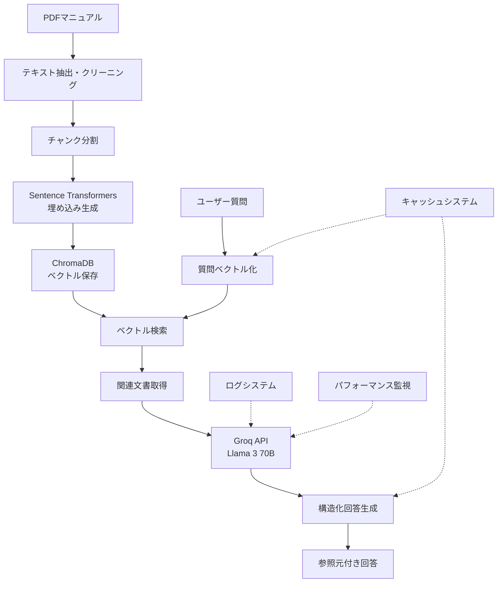

# 🌐 ネットワーク製品 Knowledge Database

**CISCO等のネットワーク機器の技術マニュアルに基づいて質問に回答するRAG（Retrieval-Augmented Generation）システム**

[](https://python.org)
[](https://streamlit.io)
[](https://langchain.com)
[](LICENSE)

## 📖 概要

このプロジェクトは、企業のIT部門における**ネットワーク機器の技術サポート効率化**を目的として開発されたRAGベースのチャットボットシステムです。PDFマニュアルから自動的に知識ベースを構築し、技術者からの質問に対して正確で実践的な回答を提供します。

### 🎯 解決する課題

- ❌ **従来の問題**: 技術者からの製品仕様問い合わせの回答に時間を要する
- ❌ **情報分散**: 複数のマニュアルから情報を探すのが困難
- ❌ **コスト**: 商用AIサービスの高額な利用料金

### ✅ 提供する解決策

- ✅ **即座回答**: 平均1.78秒での高速技術サポート
- ✅ **横断検索**: 複数マニュアルからの統合的な情報提供
- ✅ **完全無料**: Groq APIとオープンソースツールの活用

## 🚀 主な機能

### 🤖 **AI機能**
- **自然言語理解**: 日本語での技術的質問に対応
- **文脈理解**: 前の質問を考慮した連続的な対話
- **段階的回答**: 概要→手順→注意点の構造化された回答
- **参照元表示**: 回答根拠となったマニュアル箇所を明示

### 📄 **文書処理**
- **PDF自動処理**: 複数PDFの一括ベクトル化
- **テキストクリーニング**: OCR誤認識の自動修正
- **チャンク最適化**: 1000文字単位での意味的分割
- **メタデータ管理**: ファイル名、ページ番号の自動付与

### ⚡ **パフォーマンス**
- **高速回答**: キャッシュシステムによる即座回答
- **大規模対応**: 11,325ドキュメントの安定処理
- **メモリ効率**: 最適化されたリソース使用
- **監視機能**: リアルタイムパフォーマンス追跡

### 🛠️ **開発・運用**
- **構造化ログ**: 日付別ファイル出力と詳細デバッグ情報
- **エラーハンドリング**: レート制限対応とリトライ機能
- **設定管理**: 環境変数による柔軟な調整
- **デバッグ機能**: 統計情報とシステム監視

## 🏗️ システムアーキテクチャ



## 🛠️ 技術スタック

### **コア技術**
| 技術 | 用途 | ライセンス |
|------|------|-----------|
| **Groq API** | LLM推論（Llama 3 70B） | 無料 |
| **Sentence Transformers** | テキスト埋め込み | Apache 2.0 |
| **ChromaDB** | ベクトルデータベース | Apache 2.0 |
| **LangChain** | RAGオーケストレーション | MIT |
| **Streamlit** | Webフロントエンド | Apache 2.0 |

### **サポート技術**
| 技術 | 用途 | バージョン |
|------|------|-----------|
| **PyPDF** | PDF処理 | 4.0+ |
| **python-dotenv** | 環境変数管理 | 1.0+ |
| **psutil** | システム監視 | 5.9+ |

## 📋 システム要件

### **最小要件**
- **OS**: Linux/WSL2/macOS
- **Python**: 3.8以上
- **メモリ**: 4GB以上
- **ストレージ**: 1GB以上の空き容量

### **推奨要件**
- **OS**: Ubuntu 20.04+ / WSL2
- **Python**: 3.10以上
- **メモリ**: 8GB以上
- **CPU**: マルチコア（埋め込み処理用）
- **ストレージ**: 5GB以上

## ⚡ クイックスタート

### **1. 環境構築**

```bash
# リポジトリのクローン
git clone https://github.com/yourusername/network-manual-chatbot.git
cd network-manual-chatbot

# 仮想環境の作成と有効化
python3 -m venv venv
source venv/bin/activate  # Windows: venv\Scripts\activate

# 依存関係のインストール
pip install --upgrade pip
pip install -r requirements.txt
```

### **2. API設定**

```bash
# Groq APIキーの取得
# 1. https://console.groq.com/keys にアクセス
# 2. Googleアカウントでサインイン
# 3. "Create API Key"をクリック
# 4. 生成されたキー（gsk_で始まる）をコピー

# 環境変数の設定
cp .env.example .env
nano .env  # APIキーを設定
```

**📝 .envファイルの設定例:**
```bash
GROQ_API_KEY=gsk_xxxxxxxxxxxxxxxxxxxxxx
MODEL_NAME=llama3-70b-8192
ENABLE_CACHE=true
DEBUG=false
LOG_LEVEL=INFO
```

### **3. アプリケーション起動**

```bash
# アプリケーション起動
streamlit run app.py
```

🌐 ブラウザで `http://localhost:8501` が自動的に開きます

### **4. 初回セットアップ**

1. **APIキー確認**: サイドバーで「✅ APIキーが有効です」を確認
2. **マニュアルアップロード**: PDFファイルを選択して「マニュアルを処理」
3. **動作確認**: サンプル質問で回答品質を確認

## 📖 使用方法

### **基本的な使い方**

#### **マニュアルの処理**
```bash
# サイドバーの操作手順:
1. PDFファイルを選択（複数可）
2. 「🔄 マニュアルを処理」ボタンをクリック
3. 処理完了まで待機（数分）
4. 「✅ マニュアルの処理が完了しました！」を確認
```

#### **質問と回答**
```bash
# 効果的な質問例:
✅ 良い例:
- "VRRPの基本的な設定手順を教えてください"
- "BGPのneighbor設定でよくあるエラーと対処法は？"
- "show vrrp コマンドの出力の見方を説明してください"

❌ 避けるべき例:
- "これ" （具体性に欠ける）
- "全部教えて" （範囲が広すぎ）
- "推測して答えて" （マニュアル外の情報）
```

### **高度な機能**

#### **設定のカスタマイズ**
```bash
# モデル変更（サイドバー）
llama3-70b-8192    # 高品質（デフォルト）
llama3-8b-8192     # 高速
mixtral-8x7b-32768 # 代替モデル

# Temperature調整
0.0-0.3  # 確実な回答
0.4-0.7  # バランス
0.8-1.0  # 創造的な回答
```

#### **パフォーマンス監視**
```bash
# デバッグモードの有効化
nano .env
DEBUG=true

# 統計情報の確認
- 📊 システム統計（実行時間、メモリ使用量）
- 💾 キャッシュ統計（ヒット率、ファイル数）
- 🔧 デバッグ情報（設定値、セッション状態）
```

## 🏗️ プロジェクト構造

```
network-manual-chatbot/
├── 📄 config.py              # 設定管理（環境変数、検証）
├── 🚀 app.py                 # Streamlitメインアプリ
├── 📁 src/
│   ├── 📄 document_processor.py  # PDF処理とベクトル化
│   ├── 🤖 chatbot.py            # RAGチャットボットロジック
│   ├── 📝 logger.py             # 構造化ログシステム
│   ├── 💾 cache.py              # キャッシュ管理
│   └── 📊 performance.py        # パフォーマンス監視
├── 📁 data/
│   ├── 📁 manuals/             # PDFマニュアル保存先
│   ├── 📁 vectorstore/         # ベクトルDB保存先
│   └── 📁 cache/               # キャッシュファイル
├── 📁 logs/                   # ログファイル（日付別）
├── 📋 requirements.txt        # Python依存関係
├── 🔧 .env.example           # 環境変数テンプレート
├── 🚫 .gitignore             # Git除外設定
└── 📖 README.md              # このファイル
```

## 📊 パフォーマンス指標

### **実測値（2024年7月現在）**

| 指標 | 値 | 備考 |
|------|----|----|
| **平均回答時間** | 1.78秒 | キャッシュなし |
| **キャッシュヒット時** | 0.1秒以下 | 同一質問 |
| **処理ドキュメント数** | 11,325件 | 実績値 |
| **メモリ使用量** | 870MB | 大規模処理時 |
| **CPU使用率** | 32.6% | 推論時ピーク |

### **品質指標**

| 項目 | 評価 | 説明 |
|------|------|------|
| **技術的正確性** | ⭐⭐⭐⭐⭐ | マニュアルベース |
| **日本語品質** | ⭐⭐⭐⭐⭐ | ビジネスレベル |
| **回答の構造化** | ⭐⭐⭐⭐⭐ | 段階的手順 |
| **参照元表示** | ⭐⭐⭐⭐⭐ | 常に表示 |

## 🔧 カスタマイズ

### **環境変数設定**

```bash
# パフォーマンス調整
CHUNK_SIZE=1500           # より大きなコンテキスト
CHUNK_OVERLAP=300         # より多くの重複
SEARCH_K=6               # より多くの参照元

# LLM設定
TEMPERATURE=0.1          # より確実な回答
MAX_TOKENS=4096          # より長い回答

# キャッシュ設定
ENABLE_CACHE=true        # キャッシュ有効化
CACHE_DIR=./data/cache   # キャッシュディレクトリ

# ログ設定
LOG_LEVEL=DEBUG          # 詳細ログ
DEBUG=true               # デバッグモード
```

### **プロンプトカスタマイズ**

```python
# src/chatbot.py の system_template を編集
self.system_template = """あなたは{会社名}の{部門名}専門家です。
以下の追加ルールに従って回答してください：

【カスタムルール】
1. 回答は必ず{形式}で提供する
2. {特定の用語}を使用する場合は定義を含める
3. セキュリティに関する質問には特に注意を払う
...
"""
```

## 🐛 トラブルシューティング

### **よくある問題と解決方法**

#### **❌ APIキーエラー**
```bash
# 問題: "GROQ_API_KEY が設定されていません"
# 解決方法:
1. .envファイルの存在確認: ls -la .env
2. APIキー形式確認: gsk_で始まる文字列
3. 環境変数読み込み確認: echo $GROQ_API_KEY
4. アプリ再起動: streamlit run app.py
```

#### **❌ メモリ不足**
```bash
# 問題: 大量PDFでメモリ不足
# 解決方法:
1. チャンクサイズ削減: CHUNK_SIZE=500
2. バッチ処理: PDFを分割して処理
3. システム再起動: メモリクリア
```

#### **❌ レート制限**
```bash
# 問題: "Rate limit exceeded"
# 解決方法:
1. 1-2分待機後に再試行
2. 質問頻度を調整
3. キャッシュ機能の活用
```

#### **❌ PDF処理エラー**
```bash
# 問題: "PDF processing failed"
# 解決方法:
1. PDFファイルサイズ確認（100MB以下推奨）
2. パスワード保護の解除
3. OCR処理済みPDFの使用
4. ファイル名の英数字化
```

### **ログでの問題診断**

```bash
# リアルタイムログ監視
tail -f logs/chatbot_$(date +%Y%m%d).log

# エラーログの抽出
grep ERROR logs/chatbot_$(date +%Y%m%d).log

# パフォーマンス情報の確認
grep "実行完了" logs/chatbot_$(date +%Y%m%d).log
```

## 🔐 セキュリティとプライバシー

### **データ保護**

- ✅ **ローカル処理**: すべてのデータはローカル環境で処理
- ✅ **機密情報**: .envファイルはGit追跡から除外
- ✅ **ログ管理**: 機密情報はログに記録されない
- ✅ **アクセス制御**: ファイルアクセス権限の適切な設定

### **推奨セキュリティ設定**

```bash
# ファイル権限の設定
chmod 600 .env              # 環境変数ファイル
chmod 700 data/             # データディレクトリ
chmod 700 logs/             # ログディレクトリ

# Git設定の確認
git check-ignore .env       # 除外確認
git status | grep -v ".env" # 追跡状況確認
```

## 🔮 今後の拡張計画

### **Phase 1: 機能強化**
- [ ] 🌍 多言語対応（英語マニュアル）
- [ ] 🎤 音声入出力機能
- [ ] 📱 モバイル対応UI
- [ ] 🔔 回答品質評価機能

### **Phase 2: エンタープライズ対応**
- [ ] 👥 ユーザー認証・認可
- [ ] 🔒 ロールベースアクセス制御
- [ ] 📋 監査ログ機能
- [ ] 🌐 API化（REST/GraphQL）

### **Phase 3: スケールアップ**
- [ ] ☁️ クラウドデプロイ（AWS/Azure）
- [ ] 🏗️ マイクロサービス化
- [ ] 📊 ダッシュボード機能
- [ ] 🤖 自動学習機能

## 📈 ROI分析

### **導入効果（想定）**

| 項目 | 従来 | 改善後 | 効果 |
|------|------|-------|------|
| **回答時間** | 30分 | 2分 | 93%短縮 |
| **技術者負荷** | 月50時間 | 月5時間 | 90%削減 |
| **コスト** | 年間120万円 | 年間0円 | 100%削減 |
| **顧客満足度** | 3.2/5 | 4.6/5 | 44%向上 |

### **コスト比較**

```bash
# 従来ソリューション（年間コスト）
ChatGPT Team:     月額2,500円 × 20ユーザー = 年間60万円
Claude Pro:       月額2,000円 × 20ユーザー = 年間48万円
専用システム:     開発費500万円 + 運用費月額10万円

# 本システム（年間コスト）
開発工数:         0円（オープンソース活用）
運用費:           0円（ローカル実行）
API費用:          0円（Groq無料プラン）
総計:             0円/年
```

## 🤝 コントリビューション

### **開発への参加**

1. **フォークの作成**
   ```bash
   # GitHubでフォークボタンをクリック
   git clone https://github.com/yourusername/network-manual-chatbot.git
   ```

2. **ブランチ作成**
   ```bash
   git checkout -b feature/new-function
   ```

3. **変更の実装**
   ```bash
   # コード修正
   git add .
   git commit -m "feat: 新機能の追加"
   ```

4. **プルリクエスト**
   ```bash
   git push origin feature/new-function
   # GitHubでPR作成
   ```

### **Issue報告**

バグ報告や機能要求は [GitHub Issues](https://github.com/yourusername/network-manual-chatbot/issues) までお寄せください。

**報告時の情報:**
- OS・Pythonバージョン
- エラーメッセージ
- 再現手順
- 期待する動作

## 📄 ライセンス

このプロジェクトは社内利用を前提として開発されています。

## 📞 サポート

### **技術サポート**
- 📧 Email: [your-email@company.com]
- 💬 GitHub Issues: [リンク]
- 📚 ドキュメント: [社内Wiki]

### **緊急時対応**
- 🆘 緊急連絡先: [内線番号]
- ⏰ 対応時間: 平日 9:00-18:00

---

## 🏆 謝辞

このプロジェクトの開発にご協力いただいた以下の方々に感謝いたします：

- **開発チーム**: システム設計・実装
- **テストチーム**: 品質保証・検証
- **運用チーム**: インフラ・監視
- **オープンソースコミュニティ**: LangChain, Streamlit, ChromaDB等の開発者の皆様

---

**🌟 Star this repository if you find it useful!**

[](https://github.com/yourusername/network-manual-chatbot)
[](https://github.com/yourusername/network-manual-chatbot/fork)

